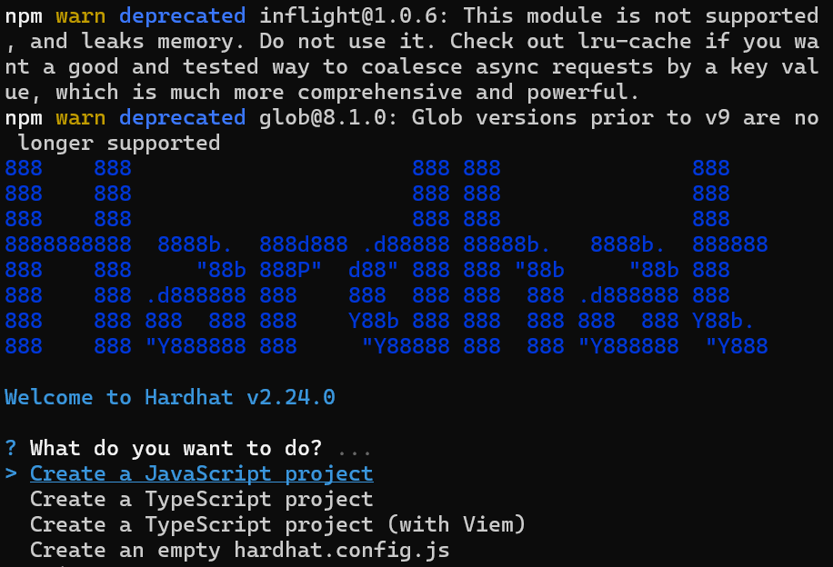

npm create vite@latest frontend

npm install -D tailwindcss postcss autoprefixer
npx tailwindcss init -p

npx shadcn-ui@latest init

npm install axios react-router-dom zustand
npm install -D vitest @testing-library/react jsdom

backend 
npm init -y

npm install express mongoose dotenv cors

Blockchain (Hardhat):
Create a contracts folder and run npx hardhat init.
Choose “Create a JavaScript project” and follow prompts.
Install Ethers.js: npm install ethers.
Test Hardhat: npx hardhat compile (should create an artifacts folder).

🌟 Context for Your Project
You’re building a multi-tenant election platform with:

Frontend: React + TypeScript + SWC + Vite + Tailwind CSS (recently fixed the content warning in tailwind.config.js).
Backend: Node.js + Express + MongoDB (multi-tenant with tenantId).
Blockchain: Solidity + Hardhat + Ethers.js for secure vote recording.
Hosting: Vercel (frontend), Render/Heroku (backend), Infura/Alchemy (Ethereum node).
Deadline: Assumed June 30, 2025 (clarify if different).